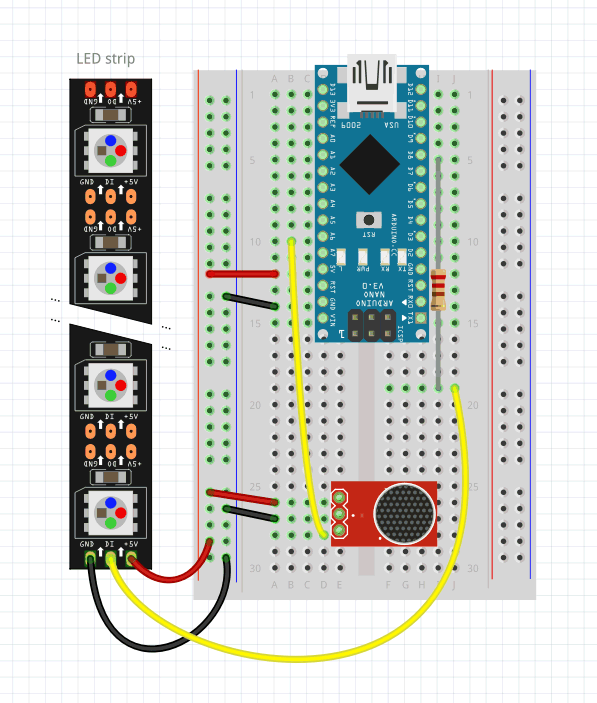
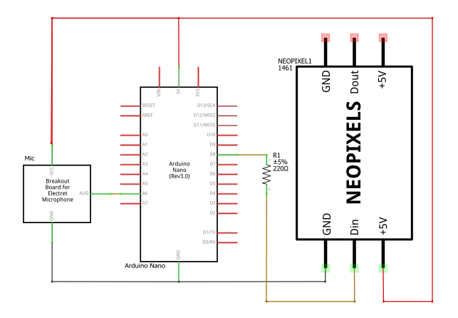

# LX' Noisemeter

This is a small fun project made during an Arduino workshop and perfected afterwards. It uses an Arduino Nano as controller and an LED strip by Adafruit. I used 10 LEDs but the code can be adjusted to use an arbitrary amount.

The wiring is as follows:

Or if you're more into schematics:

I'm not sure about the exact model of the microphone sensor. But you get the idea.

Finally here's a photo:

